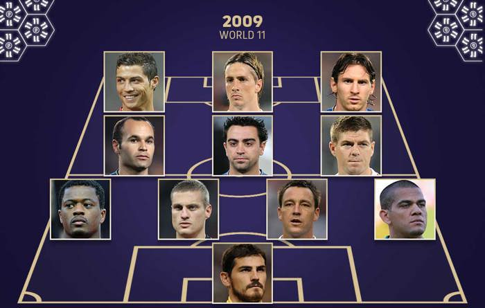

# Exercice 3 : Mise en page 11 type de tous les temps

1. Réalisez à l'aide du CSS Grid une mise en page de votre 11 type football de tous les temps. Chaque joeur doit être positionné dans une cellule au bon endroit selon votre composition.

ci-après une illustration
